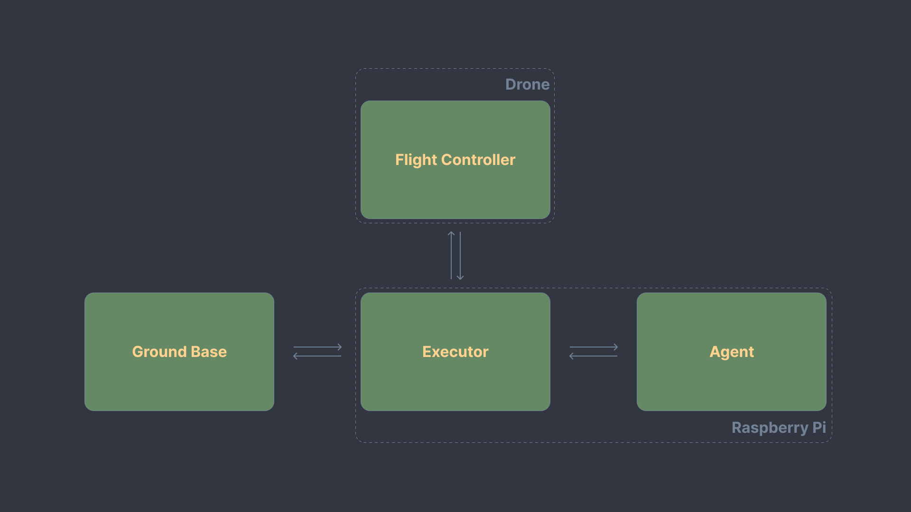

# Finch

intro

## How does it work?

The scheme above provides a basic overview of how the system works. 

To go into more detail, it can be divided into three main components:

**1. Ground Base**

This is the UI for system interaction, which sends prompts and commands via the TCP protocol. You can implement this on any device connected to the RPi access point over Wi-Fi. In our case, we are using our Electron desktop [application](https://github.com/arkadii888/GroundBase).

**2. Paspberry Pi Stack**

This can also be divided into three parts:

- **Executor**

A C++ application that hosts a TCP server for communication with the GroundBase, a gRPC server for communication with the Agent, and utilizes MAVSDK to communicate with the flight controller.

- **Agent**

- **Setup**

Upon startup, the RPi creates a Wi-Fi access point and initializes MAVProxy for drone communication. MAVProxy splits the telemetry stream into two channels: one for the Executor and another for QGroundControl(a standard application that allows you to wirelessly configure the flight controller and monitor the drone once connected to the access point).

**3. Flight Controller**

This is a flight controller with PX4 firmware installed and MAVLink communication enabled.

## How to test the model separately?

link

## How to replicate our setup?

The step by step guide is described in detail [here](https://github.com/arkadii888/Finch/blob/main/HOWTO.md).
